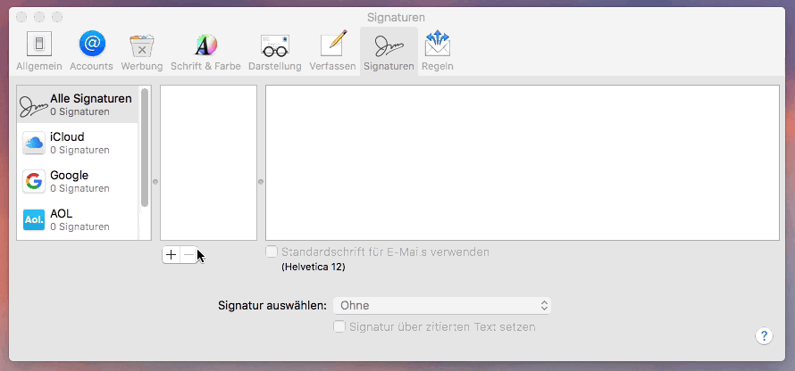

# signato 

_Semi-automated apple mail HTML signature installer_

Easily install HTML signatures in Apple Mail without fiddling around in hidden folders 😍



## Prerequisite

Create your HTML signature. Notice the [limited support of certain CSS techniques in mail clients](https://www.campaignmonitor.com/css/) and place only the `body` tag and it's children in your signature HTML file for Apple Mail. Inline all style attributes, probably using a tool like [CSS Inliner](https://inliner.cm/).

Open Apple Mail and create a new signature. Place a placeholder text in that signature. Signato by default looks for `(signato)`. It's recommended to remove everything else from the signature content. Choose a proper name for the new signature.

## Usage

1. [Download the latest version](https://github.com/Nolanus/signato/archive/master.zip) of signato and unzip it.
2. Place your HTML signature named _signature.html_ next to the `signato.sh` script or reference it using the `-s file` parameter.
3. Open a terminal and navigate to the signato script <br>([How to open and navigate in the terminal](http://blog.teamtreehouse.com/introduction-to-the-mac-os-x-command-line))
4. Run the script by typing `./signato.sh` and pressing [Enter]
5. Answer the on-screen question about iCloud synced signatures or local ones and watch the "magic" happen ;)

## FAQ

### I can't adjust the signature in Apple Mail after installing it

For local signatures the respective file on your disk will be locked to prevent Apple Mail from reverting the content change. As a consequence you are not capable of editing HTML signature installed with signato via the settings menu in Apple Mail any longer (other signatures will work fine).

However, you may create an updated version of your HTML signature and use signato to adjust the signature in Apple Mail. Use a custom placeholder text (`-p` parameter) to let signato find the oudated signature you want to change. You could for example change it to your position title which might be mentioned in the old HTML signature.

Example: look for a signature with the text _Head of Tech_ in it and replace the signature with the one from the specified HTML file 

```
./signato.sh -s "updatedHTMLSignature.html" -p "Head of Tech"
```

### I can't delete the signature

To properly delete the signature the file must be unlocked. Close Apple Mail. Run signato with the `-u` flag and a custom `-p` placeholder that matches the contents of your signature. You may now open Apple Mail again and delete the signature using the "minus" button in the settings.

Example: Unlock all signatures that contain the text "Old company" and unlock the files:

```
./signato.sh -u -p "Old company"
```

### I get "-bash: ./signato.sh: Permission denied" error

Somehow the attribute that the _signato.sh_ file is an executable file got lost. Restore that by executing `chmod +x signato.sh` and try again.

### Signa-what?!

[signato](https://en.wiktionary.org/wiki/signato) is an imperative form of the latin word "[signāre](http://www.latin-dictionary.net/definition/35028/signo-signare-signavi-signatus)" meaning "sign" or "seal".

## Parameters

| Parameter             | Description   | Default           | 
|:----------------------|:------------- |:-------------|
| `-s "filename"`       | File that contains the HTML signature | _signature.html_ |
| `-p "placeholder"`    | String to be searched for in existing signatures to identify the signature that should be replaced | _(signato)_   |
| `-u`                  | Do not replace any signature content, just unlock the matched files | _false_ |

## Credits

Thanks to Matt Coneybeare ([@coneybeare](https://github.com/coneybeare)) for [his blog post](http://matt.coneybeare.me/how-to-make-an-html-signature-in-apple-mail-for-sierra-os-x-10-dot-12/) on how to make a custom HTML signature in Apple Mail.

## License

[MIT](LICENSE)